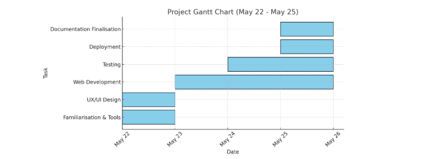
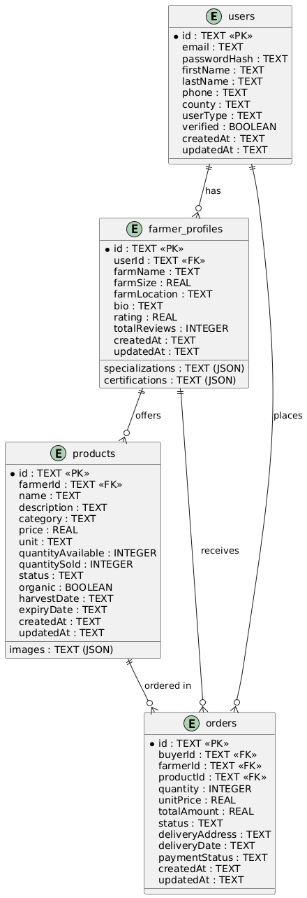

# 🌾 AGRIBABA

AGRIBABA is an agri-marketplace connecting farmers, buyers, and industry experts. We blend seamless user experience, real-time insights, and secure transactions to empower agricultural communities and drive innovation in food supply chains.

---

## 📊 Project Timeline (Gantt Chart)


---

## 🧠 Why AGRIBABA?

**Problem:** Smallholder farmers and buyers face fragmented markets, lack of trust, and limited access to data-driven insights.

**Our Solution:** AGRIBABA provides a unified, transparent platform with recommendations, dynamic pricing, and verified profiles—making trading simple, secure, and scalable.

---

## 🗃️ Database Schema (ERD)


---

## 🎯 Features

- **AI-Powered Marketplace:** Smart product recommendations, dynamic pricing, and fraud detection.  
- **Farmer & Buyer Profiles:** Verified, data-rich profiles for trust and transparency.  
- **Real-Time Insights:** Market trends, weather, and price analytics via Supabase.  
- **Smooth UX/UI:** Responsive design, elegant animations, and delightful micro-interactions.  
- **Secure Transactions:** End-to-end encryption and robust authentication.  
- **Modular Codebase:** Built with Next.js, TypeScript, and Supabase for rapid iteration.

---
## 🎥 Demo Video

Watch the demo video to see AGRIBABA in action:  
[Demo Video](./public/DemoVideo.mp4)

---

## 🛠️ Tech Stack

**Frontend:** Next.js, React, TypeScript, Tailwind CSS, Lucide-react  
**Backend:** Supabase (Postgres, Auth, Storage), API routes  
**CI/CD:** GitHub Actions, Vercel/Netlify  
**Testing:** Jest, React Testing Library

---

## 🤖 AI Tools Utilized

This project was powered and accelerated by the use of cutting-edge AI tools:

- **Windsurf** – Streamlined analytics and product intelligence.  
- **V0.dev** – Rapid UI generation from natural language prompts.  
- **Claude.ai** – Used for troubleshooting code.  
- **Supabase** – Backend-as-a-Service for real-time database, auth, and storage.  
- **Canva AI** – For designing visual assets, infographics, and promotional content.  
- **UIZard** – Ideation of the user interface  
- **Visily.ai** – Assisted in UI ideation, mockups, and UX flow modeling.

---

## 🚦 Quickstart

```bash
1. Clone the repo
git clone https://github.com/254Manuell/PLP-VIBE-CODE-AGRIBABA-WEBSITE.git
cd PLP-VIBE-CODE-AGRIBABA-WEBSITE

2. Install dependencies
npm install

3. Configure environment variables
cp .env.example .env.local

# Add your Supabase keys and other secrets

4. Run locally
npm run dev

5. Open http://localhost:3000
```

---

## 🧪 Testing

```bash
# Run all tests
npm run test
```

All major features are covered by unit and integration tests. See `/tests` for custom scenarios and edge case handling.

---

## 🔐 Security & Reliability

* All sensitive data is encrypted and never exposed client-side.
* Robust error boundaries and fallback UIs for fault tolerance.
* Input validation and sanitization on all forms and API endpoints.
* API keys are never exposed in the frontend.

---

## 👥 Contributing

We welcome contributions in UI/UX, AI prompt engineering, and backend logic to improve the project!

```bash
Fork the repo and create your branch
git checkout -b feature/your-feature

Commit your changes
git commit -am 'Add new feature'

Push to the branch
git push origin feature/your-feature

Open a Pull Request
```

---

## 🔗 Essential Links

* **Vercel Deployment:**  
  [https://vercel.com/joankiema-gmailcoms-projects/plp-vibe-code-agribaba-website/7q9v8sjgWvecCR3gFRDnXUVtiNct](https://plp-vibe-code-agribaba-website.vercel.app/)
* **Contact Email:**  
  ngunnzie@gmail.com

---

## 🏁 Contributors from Group (Syntax 176)

* **Emmanuel Ngunnzi** – [254Manuell](https://github.com/254Manuell)
* **Billiant Mwendwa** – [Brillywam](https://github.com/Brillywam)
* **Eugene Ambagwa** – [Ambagwa](https://github.com/Ambagwa)
```


   
